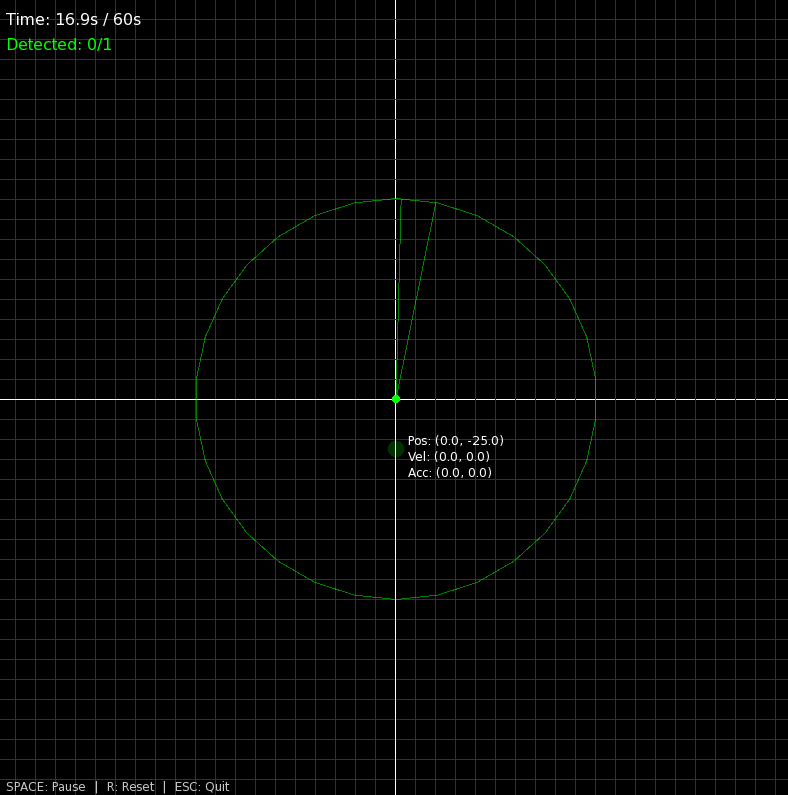

# Radar Sim

A **2D radar simulation** built in C++ using [SFML](https://www.sfml-dev.org/).  
It simulates moving targets in a defined world space, visualizes them on a radar display, and logs both **real trajectory data** and **detection results** to CSV files.


## Features
- Real-time radar visualization with targets and detection lines.
- Moving targets with trails.
- Radar scan visualization with range circle.
- CSV logging:
  - `trajectory.csv` → positions and velocities of all targets over time.
  - `detections.csv` → detection results (distance, bearing, radial velocity, etc.).
- Interactive controls:
  - **SPACE** → Pause/Resume  
  - **R** → Reset simulation  
  - **ESC** → Quit  


## Requirements
- C++17 or later
- SFML 2.5+
- CMake (recommended) or your preferred build system


## Build & Run
Clone and build the project:
```bash
git clone https://github.com/ordinary813/radar-sim.git
cd radar-sim
mkdir build && cd build
cmake ..
make
./radar-sim
```

### Build & Run with Docker (Optional)
```bash
docker build -t radar-sim .
xhost +local:docker
docker run --rm -it \
    -e DISPLAY=$DISPLAY \
    -v /tmp/.X11-unix:/tmp/.X11-unix \
    -v $(pwd)/data:/app/data \
    radar-sim
```
When done, execute the following command to restrict docker from using X server:
```bash
xhost -local:docker
```

---

Data will be logged into the `data/` directory.
- `data/trajectory.csv`
- `data/detections.csv`


## Screenshot


